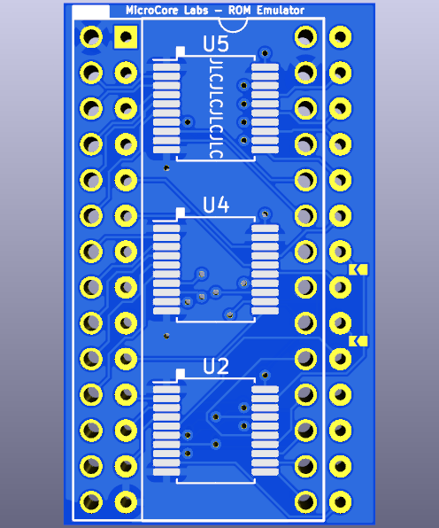
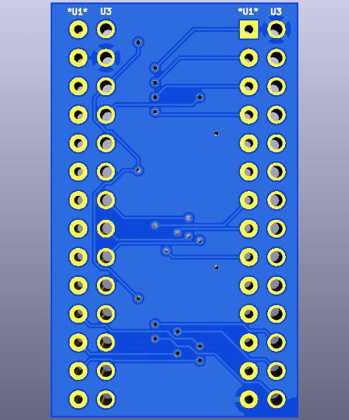

# EPROM_Emulator/PCB
EPROM Emulator - Small PCB which uses Teensy 4.0 to emulate up a 64KB 27C512 EPROM

 

This is PCB was designed in KiCAD 6.10 and uses MicroCore Lab's EPROM Emulator as a base.  All traces were redone and 2 solder jumper pads were added to the front along the right side of the board to make the board Chip Select(CS) pin configurable.

The Nabu uses Pin 20 for Chip Select (lower solder jumper) and the IBM PC uses the Pin 22 for Chip Select (upper solder jumper) which is what the board was originally designed for.

Please solder closed the appropriate solder jumper pads before use. Neither solder jumpers are connected by default!
